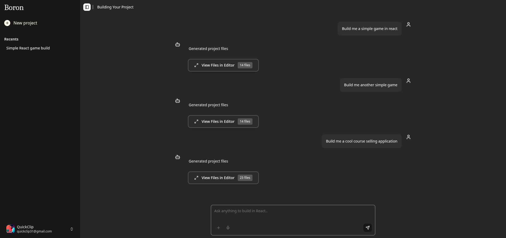
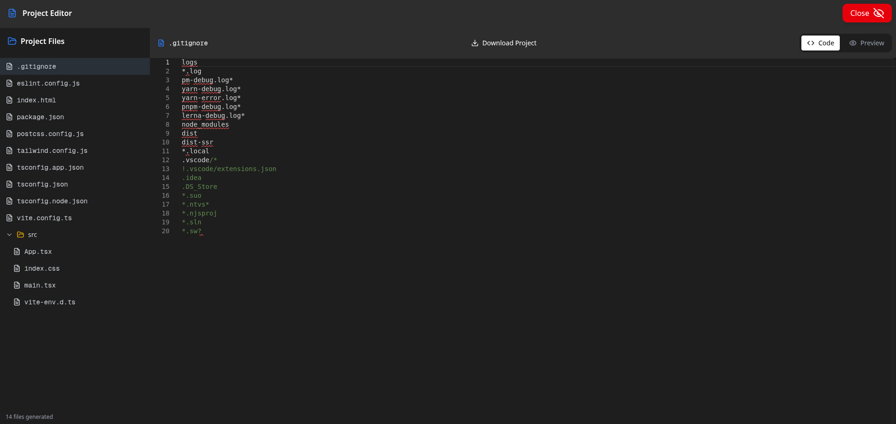
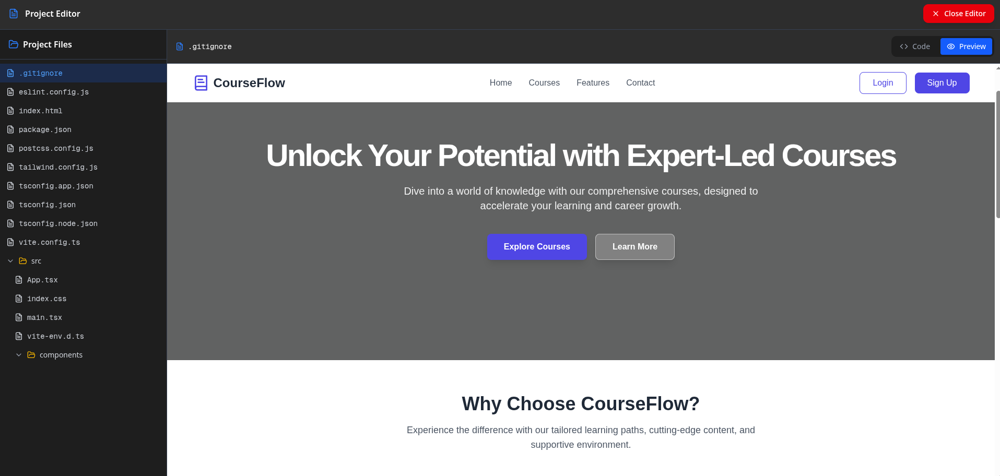

<div align="center">

## Boron - A GPT wrapper that builds and previews your MVP


<br />



</div>

### Check demo

<a href="https://www.youtube.com/watch?v=Zn6nJJ5bhRw" title="watch it building a demo site here">Watch the demo on YouTube</a>

### Dev Setup

```
git clone https://github.com/bandhan-majumder/Boron
cd Boron
```

then, install al the dependencies with

```
pnpm install
```

copy .env.example file and create a .env file with

```
cp .env.example .env
cp apps/boron/.env.example apps/boron/.env
```

add the valuese of your .env. then run the app by

```
pnpm dev
```

application should be running on port 3000

### Technologies used

1. Turborepo
2. Better-Auth
3. AI-SDK
4. Prisma
5. Neon
6. Shadcn UI
7. Webcontainer (StackBlitz)
8. Vercel
